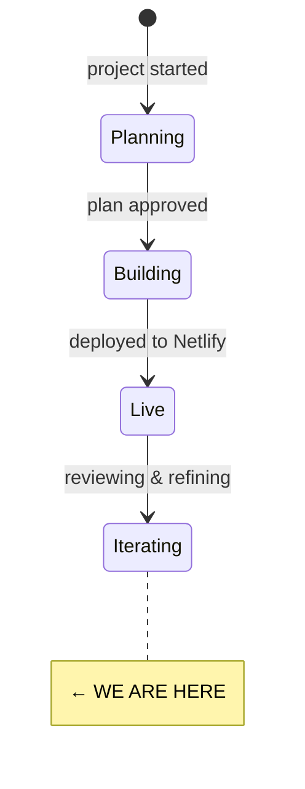

# State

> Last updated: 2026-02-13

## System State Diagram



## Component Status

| Component | Status | Notes |
|-----------|--------|-------|
| HTML structure | ✅ Done | Single-file `index.html`, semantic HTML5 |
| CSS / theming | ✅ Done | Custom properties, fluid typography, responsive breakpoints |
| SVG illustrations | ✅ Done | Inline SVGs for hero, services, tools, frameworks |
| Hero section | ✅ Done | Compass rose SVG with animation, tagline, intro |
| About section | ✅ Done | Tom's story, Data for Action legacy, client list |
| Services section | ✅ Done | 6 service cards with SVG icons |
| Tools section | ✅ Done | Card grid with external links, TechFreedom "Launching Soon" badge |
| Frameworks section | ✅ Done | 4 PDFs available for download in `frameworks/` |
| Writing section | ✅ Done | Links to tomcw.xyz blog |
| Contact section | ✅ Done | Netlify signup form, email, book-a-call CTA |
| Navigation | ✅ Done | Anchor links, hamburger on mobile |
| Scroll animations | ✅ Done | Intersection Observer fade-ins |
| SEO | ✅ Done | OG/Twitter cards, JSON-LD, sitemap, robots.txt, llms.txt |
| Favicon | ✅ Done | SVG favicon |
| OG image | ✅ Done | `og-image.html` + `og-image.png` |
| Analytics | ✅ Done | Plausible script tag |
| Accessibility | ⚠️ Needs attention | No formal audit done yet |
| RSS blog integration | ⏳ Not started | Plan says Option A (client-side fetch) — currently just a static link |
| Collaboration Spectrum framework | ⏳ Not started | Listed in plan but no PDF in `frameworks/` |
| Organisational Resilience Toolkit | ⏳ Not started | Listed in plan but no PDF in `frameworks/` |

## File Structure

```
thegoodship/
├── index.html          — the entire site (78KB, single file)
├── favicon.svg         — SVG favicon
├── og-image.html       — template for generating OG image
├── og-image.png        — generated OG image
├── sitemap.xml         — sitemap
├── robots.txt          — robots directives
├── llms.txt            — AI-readable site description
├── frameworks/         — downloadable PDFs
│   ├── garden-of-ideas.pdf
│   ├── principles-of-good-data.pdf
│   ├── simple-facilitation-tools-for-teams.pdf
│   └── theory-of-change-slides.pdf
└── good-ship-redesign-plan.md  — original design plan
```

## Dependencies

| Dependency | Status | Notes |
|------------|--------|-------|
| Google Fonts (Fraunces, DM Sans, JetBrains Mono) | Working | Loaded with `display: swap` |
| Plausible Analytics | Working | Lightweight, no cookies |
| Netlify (hosting/forms) | Working | Signup form uses Netlify Forms |
| cal.com (booking) | Working | Book a call CTA links here |
| tomcw.xyz (blog) | Working | Static link only — RSS integration not yet built |

<!--
Keep this file as the single source of truth for "where are we?"
The /status command reads this file.
-->
