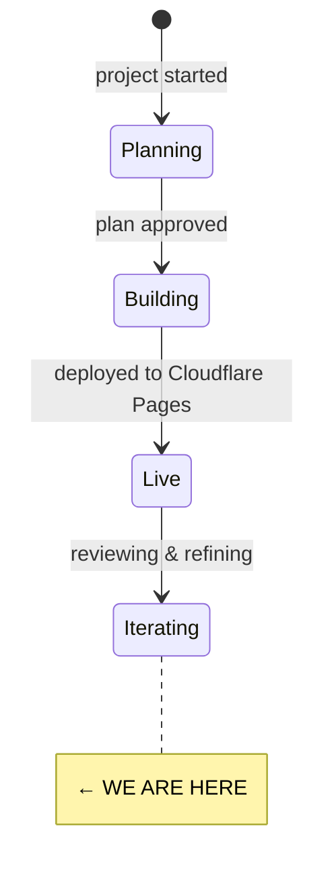

# State

> Last updated: 2026-06-11
> Hosting: **Cloudflare Pages** (migrated from Netlify) — repo `dataforaction-tom/thegoodship`

## System State Diagram

```mermaid
stateDiagram-v2
    [*] --> Planning: project started
    Planning --> Building: plan approved
    Building --> Live: deployed to Cloudflare Pages
    Live --> Iterating: reviewing & refining

    note right of Iterating: ← WE ARE HERE
```

## Component Status

| Component | Status | Notes |
|-----------|--------|-------|
| HTML structure | ✅ Done | Single-file `index.html`, semantic HTML5 |
| CSS / theming | ✅ Done | Custom properties, fluid typography, responsive breakpoints |
| Hero / About / Services | ✅ Done | Inline SVGs, compass rose animation |
| Tools section | ✅ Done | Featured strip + category filters; includes Drift, Bearing, Swells |
| Frameworks section | ✅ Done | Downloadable PDFs in `frameworks/` (incl. responsible-ai-slides.pdf) |
| Writing section | ✅ Done | Links to tomcw.xyz; `functions/feed.js` proxies the RSS feed |
| Sponsor section | ✅ Done | Drift payment form embed + **open ledger** (see below) |
| Open ledger | ✅ Live | Drift webhook → D1 → `/api/ledger` → rendered in sponsor section. Verified with a real £5 payment. |
| Newsletter signup | ✅ Live | D1-backed `/api/subscribe` (replaced inert Netlify Forms) |
| Contact section | ✅ Done | Email, cal.com booking, newsletter form |
| Navigation | ✅ Done | Anchor links, hamburger on mobile |
| Sub-pages | ✅ Done | `/shipyard/`, `/open-org/`, `/slow-post/`, `/responsible-ai/` |
| SEO | ✅ Done | OG/Twitter cards, JSON-LD, sitemap, robots.txt, llms.txt |
| Analytics | ✅ Done | Plausible (new tagged-script format) |
| Accessibility | ⚠️ Needs attention | No formal audit done yet |

## Backend (Cloudflare Pages Functions + D1)

| Endpoint | File | Purpose |
|----------|------|---------|
| `GET /feed` | `functions/feed.js` | Proxies tomcw.xyz RSS |
| `POST /api/sponsor-webhook` | `functions/api/sponsor-webhook.js` | Drift sponsorship webhook → `sponsors` |
| `GET /api/ledger` | `functions/api/ledger.js` | Public ledger JSON (CORS open) |
| `GET /api/captures` | `functions/api/captures.js` | Token-gated debug read of `raw_captures` |
| `POST /api/subscribe` | `functions/api/subscribe.js` | Newsletter signup → `subscribers` |
| `GET /api/subscribers` | `functions/api/subscribers.js` | Token-gated CSV/JSON export of `subscribers` |

- **D1 database:** `good-ship-ledger`, bound as `DB` (Production).
- **Shared parser:** `lib/parse-submission.mjs` (pure, unit-tested in `test/`).
- **Schema:** `schema.sql` (fresh installs); `migrations/000N_*.sql` (applied incrementally).
- **Tables:** `sponsors`, `raw_captures`, `subscribers`.
- **Env vars (Pages, Production):** `DB` binding, `WEBHOOK_TOKEN`, `DEBUG_TOKEN`.

## Drift configuration

- Sponsor form `formId: ptwFhkl5iFu63BRFj0H2F` ("Supporting open resources"), embedded as `supporting-open-resources-PTNp3v`.
- Webhook → `POST https://good-ship.co.uk/api/sponsor-webhook`, with custom header `X-Webhook-Token` matching `WEBHOOK_TOKEN`.
- Webhook payload includes a `payment` object (`status`, `amount` in minor units, `currency`, `stripePaymentIntentId`) — added so the ledger has a trustworthy amount.

## Dependencies

| Dependency | Status | Notes |
|------------|--------|-------|
| Cloudflare Pages | Working | Hosting + Functions + D1 |
| Drift (driftforms.app) | Working | Sponsor payment form + webhook (Stripe-backed) |
| Stripe | Working | Processes sponsor payments (via Drift); PI stored for audit |
| Google Fonts | Working | Fraunces, DM Sans, JetBrains Mono |
| Plausible Analytics | Working | No cookies |
| cal.com | Working | Book-a-call CTA |
| tomcw.xyz | Working | Blog link + RSS proxy |

<!--
Keep this file as the single source of truth for "where are we?"
The /status command reads this file. See HANDOFF.md for the latest session notes.
-->
